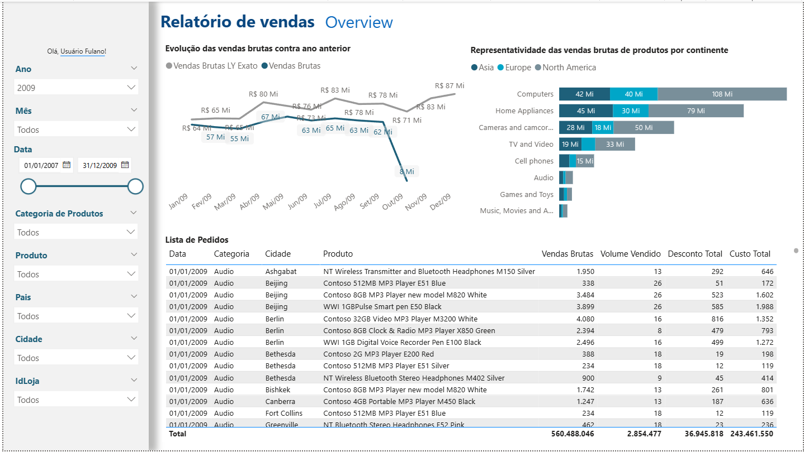
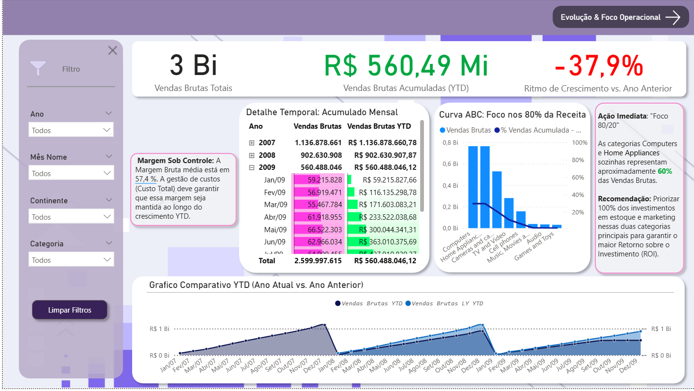

# Análise e Desenvolvimento de Relatório Power BI

## Imagens




## Resumo / Destaques Técnicos
<details>
<summary>Clique para expandir</summary>

- **Projeto:** Relatório Dinâmico de Vendas em Power BI  
- **Foco:** Modelagem de Dados, DAX Avançado e Design de Dashboards  
- **Ferramentas:** Power BI Desktop, DAX, Excel  
- **Principais Competências:**
  - Estruturação de modelo estrela (Star Schema)
  - Desenvolvimento de medidas DAX personalizadas
  - Aplicação de conceitos de Time Intelligence
  - Design analítico com foco em UX e acessibilidade
  - Criação de métricas de Curva ABC (Pareto) e KPIs estratégicos

</details>

---

## Visão Geral do Projeto 
<details>
<summary>Resumo do Projeto</summary> 

Este projeto foi desenvolvido como parte de um teste técnico de Business Intelligence (BI), com foco na criação de um **relatório dinâmico no Power BI**. O objetivo foi transformar dados brutos em **insights acionáveis**, aplicando modelagem eficiente, expressões DAX avançadas e design de dashboards voltado à experiência do usuário.

O relatório final possui duas páginas principais:

| Página | Função Analítica |
|--------|----------------|
| Dashboard / Visão Geral | KPIs estratégicos e indicadores de vendas e performance |
| Análise Detalhada | Curva ABC (Pareto) e análise de tendências históricas |

</details>

---

## Modelagem de Dados e Arquitetura
<details>
<summary>Detalhes do Modelo de Dados</summary>

A estabilidade e performance do relatório dependem de uma **modelagem bem estruturada**. Foi adotado o modelo estrela (Star Schema), prática recomendada em projetos analíticos.

### Estrutura do Modelo

| Tipo | Nome | Descrição |
|------|------|-----------|
| Fato | `fVendas` | Contém todas as transações |
| Dimensão | `dCalendario`, `dProdutos`, `dGeografia` | Atributos descritivos para análise |

Essa arquitetura garante consultas otimizadas e processamento DAX eficiente, mantendo **integridade referencial** e contexto correto entre medidas.

### Tabela de Calendário (`dCalendario`)
- Fundamental para **Time Intelligence**  
- Relacionamento 1:* com a tabela de fatos  
- Permite comparações temporais precisas, como análises anuais e acumuladas

</details>

---

## Análises e Implementações DAX
<details>
<summary>Medidas e Lógica DAX</summary>

### 1. Vendas Brutas LY Exato
- **Objetivo:** Comparar vendas do ano atual com o ano anterior, até o mesmo dia e mês da última transação do ano atual  
- **Desafio:** Funções nativas (`SAMEPERIODLASTYEAR`, `DATEADD`) não permitem controle granular do período  
- **Solução:** Construção manual do intervalo de datas com `DATESBETWEEN`

```DAX
VAR vFinalDates = DATESBETWEEN('dCalendario'[Data], vStartOfYearLY, vFinalEndDate)
VAR vResult = CALCULATE([Vendas brutas], KEEPFILTERS(vFinalDates))
RETURN IF(NOT ISBLANK([Vendas brutas]), vResult)
```

Essa abordagem garante comparações realistas entre anos, mesmo com bases de dados de diferentes períodos.

</details>

## Vendas Acumulada - ABC
<details>
<summary>Detalhes da Medida</summary>

- **Objetivo:** Calcular contribuição percentual acumulada das categorias (Curva ABC / Pareto)  
- **Ferramentas:** `CALCULATE`, `SUMMARIZE`, `FILTER`, `ALLSELECTED`, `RANKX`  
- **Descrição:** Acumula percentual de vendas em ordem decrescente, respeitando filtros aplicados pelo usuário

</details>

---

## Design e Experiência do Usuário (UX)
<details>
<summary>Detalhes de UX e Visualizações</summary>

### Paleta de Cores
- Tons institucionais: roxo/lilás e azul marinho  
- Garantias:
  - Contraste e legibilidade conforme padrões WCAG
  - Diferenciação clara entre séries de dados

### Gráfico de Tendência
- Comparação entre Vendas LY e Vendas Atuais via gráfico de linha  
- Rótulos de dados posicionados manualmente  
- Séries temporais claramente identificadas

### Visual da Curva ABC
- Gráfico combinado (colunas + linha) representando regra 80/20
  - Eixo primário: valores absolutos de vendas  
  - Eixo secundário: percentual acumulado  
- Layout intuitivo evidenciando categorias mais relevantes

### Formatação de Unidades
- Padrão: `R$ #,##0,,.0 M`  
- Substituição do padrão “Mi” por “M” para maior clareza visual

</details>

---

## Conclusão
<details>
<summary>Resumo Final</summary>

O projeto demonstra a capacidade de construir **soluções completas em Power BI**, desde a modelagem até a entrega visual. A combinação de **DAX avançado**, **modelagem estruturada** e **design orientado a insights** garante um resultado robusto e profissional, adequado para **tomada de decisão corporativa**.

</details>

---

## Como Visualizar o Projeto
<details>
<summary>Instruções</summary>

- Abra o arquivo `.pbix` no **Power BI Desktop** (versão mais recente)  
- O relatório é totalmente funcional e **não depende de conexão externa**

</details>

---

## Autor
<details>
<summary>Informações do Autor</summary>

**Enzo Santana**  
Estudante de Ciência da Computação • UNASP-SP  
Foco: Business Intelligence, Análise de Dados e Modelagem DAX

</details>

LinkedIn
 • [GitHub](https://github.com/Enzo-Santana)
 • [E-mail](enzogcsantana21@gmail.com)
 • [LinkedIn](https://www.linkedin.com/in/enzo-g-c-santana/)
